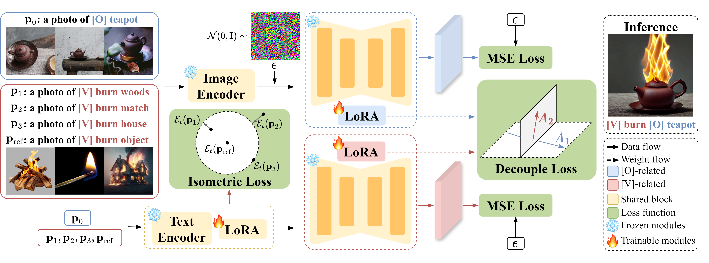

<div align="center">

<h1>PhyDiff: Towards Realistic Physical Transformations in Text-to-Image Diffusion Models</h1>


[Fan Wu](https://wufan-cse.github.io/)<sup>1</sup>, Cheng Chen<sup>1</sup>, Zhoujie Fu<sup>1</sup>, Xulei Yang<sup>2</sup>, Yi Xu<sup>3</sup>, [Guosheng Lin](https://guosheng.github.io/)<sup>1</sup><sup>&#8224;</sup>

<sup>1</sup>Nanyang Technological University,
<sup>2</sup>A*STAR,
<sup>3</sup>OPPO US Research Center,
<sup>&#8224;</sup>Corresponding author

[//]: # (CVPR 2024)

<a href="">
</a>
<a href="https://github.com/wufan-cse/PhyDiff">
</a>

</div>

## 📖 Abstract
<div style="text-align: center;">
    
</div>
<p>
    In this paper, we address a realistic task, physical transformations image generation, where we aim to freely combine physical concepts on open-world objects to generate natural and meaningful images. 
    We propose PhyDiff, a diffusion-based model fine-tuning framework using a few images and corresponding text prompts as inputs to perform realistic and meaningful physical transformations on open-world objects. 
    PhyDiff comprises two novel regularization loss functions. 
    One is concept decouple loss, which helps to decouple the mixture of independent features from multiple input concept data, ensuring the diffusion model learns the representations, respectively. 
    The other is isometric loss, which helps to extract the invariant features existing in the cross-object physical concept data. 
</p>


## 🚀 Run
1. follow [diffusers](https://huggingface.co/docs/diffusers/installation) for installation

2. run the fine-tuning code
```
python train.py
```

3. run the inference code
```
python inference.py
```

## 🌄 Results of PhyDiff
<div style="text-align: center;">
    
</div>


## 🗓️ TODO
- [ ] Release code
- [x] Release datasets

[//]: # (## 🎫 License)
[//]: # (For non-commercial academic use, this project is licensed under [the 2-clause BSD License]&#40;https://opensource.org/license/bsd-2-clause&#41;. )
[//]: # (For commercial use, please contact: [Chunhua Shen]&#40;mailto:chhshen@gmail.com&#41;)


## 🖊️ BibTeX
If you find this project useful in your research, please consider cite:

```bibtex
@article{wu2024phydiff,
  title={PhyDiff: Towards Realistic Physical Transformations in Text-to-Image Diffusion Models},
  author={Wu, Fan and Chen, Cheng and Fu, Zhoujie and Yang, Xulei and Xu, Yi and Lin, Guosheng},
  journal={},
  year={2024}
}
```

## 🙏 Acknowledgements
We thank to [Stable Diffusion](https://huggingface.co/stable-diffusion-v1-5/stable-diffusion-v1-5) for the releasing models and codes, [FreeCustom](https://github.com/aim-uofa/FreeCustom/tree/main) for the project page.

## 📧 Contact

If you have any technical comments or questions, please open a new issue or feel free to contact [Guosheng Lin](https://guosheng.github.io/)